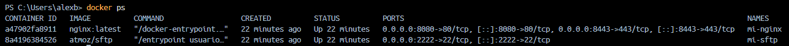
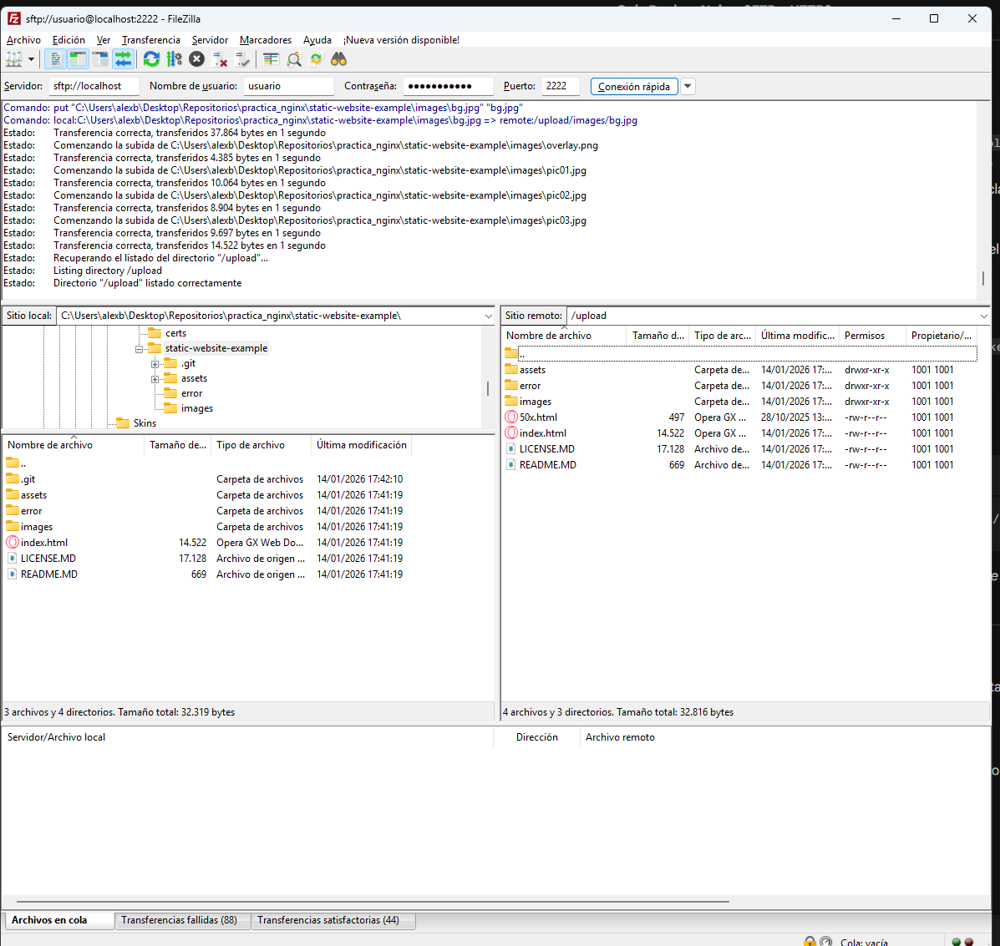
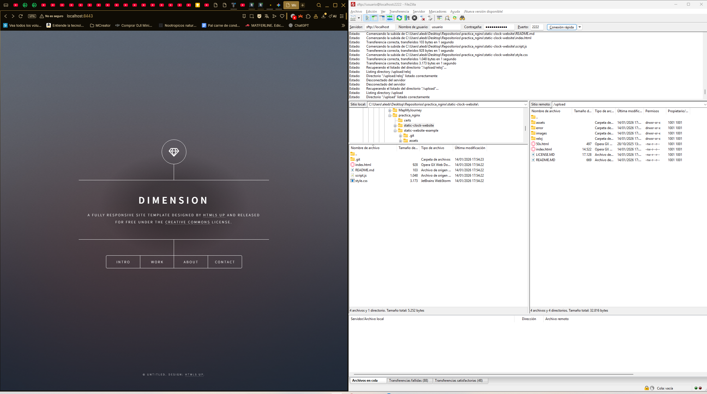
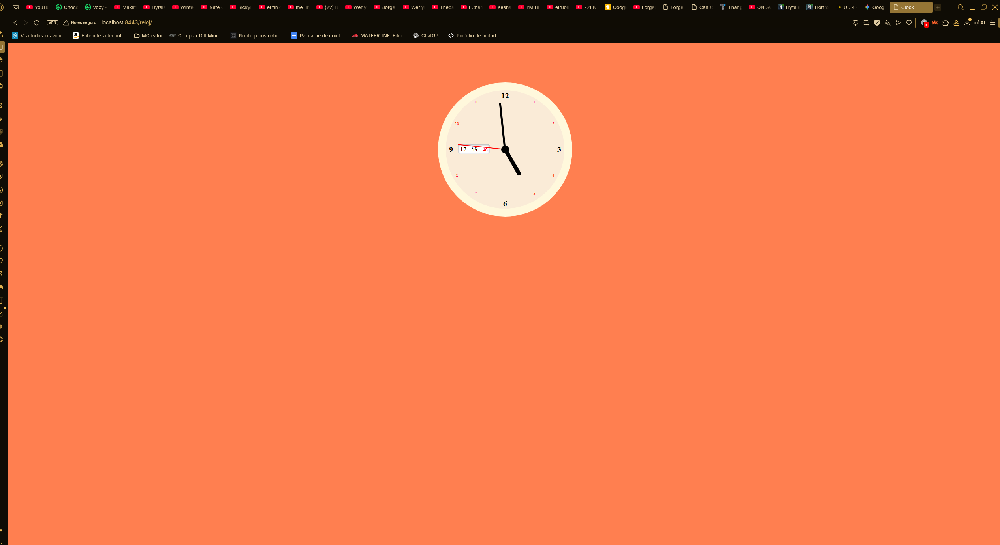
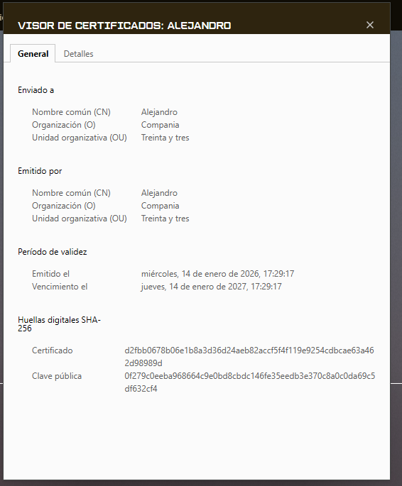
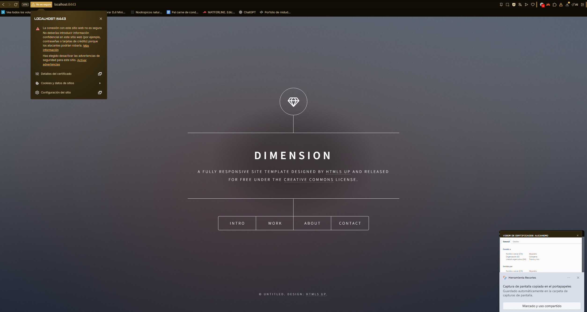
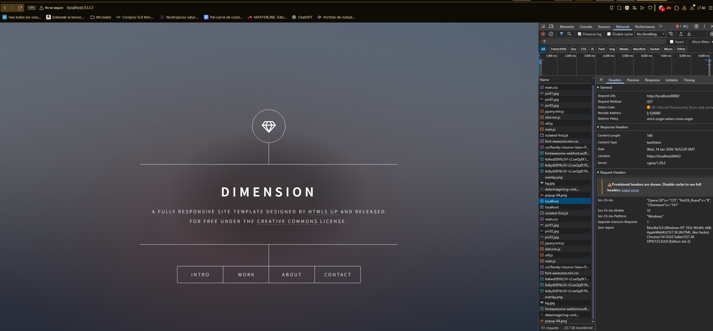

# DESPLIEGUE — Evidencias y respuestas

Este documento recopila todas las evidencias y respuestas de la practica.

---

## Parte 1 — Evidencias minimas

### Fase 1: Instalacion y configuracion

1) Servicio Nginx activo
- Que demuestra: La evidencia demuestra que los contenedores de nginx y sftp estan iniciados y funcionan correctamente, tambien demuestra los puertos abiertos.
- Comando: docker ps
- Evidencia: 

2) Configuracion cargada
- Que demuestra: Con este comando enseñamos el contenido de la configuracion que hay cargado dentro del contenedor de nginx.
- Comando: docker exec mi-nginx cat /etc/nginx/conf.d/default.conf
- Evidencia: 

3) Resolucion de nombres
- Que demuestra: Demuestra el navegador utilizando el nombre configurado en vez de la ip.
- Evidencia: .png)
- Evidencia 2: 

4) Contenido Web
- Que demuestra: Demuestra la web de Cloud Academy desplegada en el navegador.
- Evidencia: 

### Fase 2: Transferencia SFTP (Filezilla)

5) Conexion SFTP exitosa
- Que demuestra: Demuestra la conexión exitosa con Filezilla a el contenedor sftp
- Evidencia: 

6) Permisos de escritura
- Que demuestra: Se muestra el Filezilla con la web de Cloud Academy subida a el contenedor sftp
- Evidencia: 

### Fase 3: Infraestructura Docker

7) Contenedores activos
- Que demuestra: La evidencia demuestra que los contenedores de nginx y sftp estan iniciados y funcionan correctamente, tambien demuestra los puertos abiertos.
- Comando: docker ps
- Evidencia: 

8) Persistencia (Volumen compartido)
- Que demuestra: Se muestra que la web de Cloud Academy esta desplegada y que los archivos en el filezilla estan subidos.
- Evidencia: 

9) Despliegue multi-sitio
- Que demuestra: Se observa que la pagina se encuentra en localhost:8443/reloj , demostrando que funciona el despliegue multi-sitio.
- Evidencia: 

### Fase 4: Seguridad HTTPS

10) Cifrado SSL
- Que demuestra: La primera evidencia demuestra los certificados con el visor de certificados del navegador y la segunda evidencia muestra la alerta de seguridad.
- Evidencia: 
- Evidencia 2: 

11) Redireccion forzada
- Que demuestra: Demuestra que a habido una redireccion al entrar en la pagina.
- Evidencia: 

---

## Parte 2 — Evaluacion RA2 (a–j)

### a) Parametros de administracion
- Respuesta:
  - 1. Que controla cada directiva:
    - worker_processes: Es el numero de procesos trabajadores.
    - error_log: Define donde se guardan los mensajes de error.
    - worker_connections: Es el maximo de conexiones que puede manejar cada worker_process.
    - include: Es para incluir ficheros de configuración en ese punto.
    - access_log: Define la ruta donde se guarda el registro de accesos.
    - keepalive_timeout: Tiempo en segundos que Nginx va a mantener abierta una conexión.
    - gzip: Activa la compresión gzip para respuestas HTTP
  - 2. Configuración incorrecta para cada directiva:
    - worker_processes: 
      - Establecerlo en 1 o un numero bajo, esto bajaria el rendimiento de la pagina. 
      - Comprobacion (comando): 
      - Evidencia: 
    - error_log: 
      - Configurandolo como /dev/null, que descartaria los errores e impediria ver errores importantes
      - Comprobacion (comando): 
      - Evidencia: 
    - worker_connections: 
      - Estableciendolo a 1024 o un numero alto, sobrecargaria a nginx y tendria que rechazar muchas conexiones por no tener espacio.
      - Comprobacion (comando): 
      - Evidencia: 
    - include: 
      - Configurando una ruta erronea, resultando en que no se cargue parte de la configuración deseada.
      - Comprobacion (comando): 
      - Evidencia: 
    - access_log: 
      - Poniendolo en off, perderías logs importante para el analisis del tráfico de la pagina.
      - Comprobacion (comando): 
      - Evidencia: 
    - keepalive_timeout: 
      - Configurandolo a 0, que deshabilitaria esta opcion lo que aumenta la latencia, o configurandolo a 3600 que mantendria demasiado tiempo las conexiones ocupadas agotandolas.
      - Comprobacion (comando): 
      - Evidencia: 
    - gzip: 
      - Configurarlo en off, lo que no comprimiria las respuesta consumiendo mas ancho de banda y tiempo de carga.
      - Comprobacion (comando): 
      - Evidencia: 
  - 3. Cambio aplicado
- Evidencias: 
  - 
  - evidencias/a-02-nginx-t.png
  - evidencias/a-03-reload.png

### b) Ampliacion de funcionalidad + modulo investigado
- Opcion elegida (B1 o B2):
- Respuesta:
- Evidencias (B1 o B2):
  - evidencias/b1-01-gzipconf.png
  - evidencias/b1-02-compose-volume-gzip.png
  - evidencias/b1-03-nginx-t.png
  - evidencias/b1-04-curl-gzip.png
  - evidencias/b2-01-defaultconf-headers.png
  - evidencias/b2-02-nginx-t.png
  - evidencias/b2-03-curl-https-headers.png

#### Modulo investigado: <NOMBRE>
- Para que sirve:
- Como se instala/carga:
- Fuente(s):

### c) Sitios virtuales / multi-sitio
- Respuesta:
- Evidencias:
  - evidencias/c-01-root.png
  - evidencias/c-02-reloj.png
  - evidencias/c-03-defaultconf-inside.png

### d) Autenticacion y control de acceso
- Respuesta:
- Evidencias:
  - evidencias/d-01-admin-html.png
  - evidencias/d-02-defaultconf-auth.png
  - evidencias/d-03-curl-401.png
  - evidencias/d-04-curl-200.png

### e) Certificados digitales
- Respuesta:
- Evidencias:
  - evidencias/e-01-ls-certs.png
  - evidencias/e-02-compose-certs.png
  - evidencias/e-03-defaultconf-ssl.png

### f) Comunicaciones seguras
- Respuesta:
- Evidencias:
  - evidencias/f-01-https.png
  - evidencias/f-02-301-network.png

### g) Documentacion
- Respuesta:
- Evidencias: enlaces a todas las capturas

### h) Ajustes para implantacion de apps
- Respuesta:
- Evidencias:
  - evidencias/h-01-root.png
  - evidencias/h-02-reloj.png

### i) Virtualizacion en despliegue
- Respuesta:
- Evidencias:
  - evidencias/i-01-compose-ps.png

### j) Logs: monitorizacion y analisis
- Respuesta:
- Evidencias:
  - evidencias/j-01-logs-follow.png
  - evidencias/j-02-metricas.png

---

## Checklist final

### Parte 1
- [ ] 1) Servicio Nginx activo
- [ ] 2) Configuracion cargada
- [ ] 3) Resolucion de nombres
- [ ] 4) Contenido Web (Cloud Academy)
- [ ] 5) Conexion SFTP exitosa
- [ ] 6) Permisos de escritura
- [ ] 7) Contenedores activos
- [ ] 8) Persistencia (Volumen compartido)
- [ ] 9) Despliegue multi-sitio (/reloj)
- [ ] 10) Cifrado SSL
- [ ] 11) Redireccion forzada (301)

### Parte 2 (RA2)
- [ ] a) Parametros de administracion
- [ ] b) Ampliacion de funcionalidad + modulo investigado
- [ ] c) Sitios virtuales / multi-sitio
- [ ] d) Autenticacion y control de acceso
- [ ] e) Certificados digitales
- [ ] f) Comunicaciones seguras
- [ ] g) Documentacion
- [ ] h) Ajustes para implantacion de apps
- [ ] i) Virtualizacion en despliegue
- [ ] j) Logs: monitorizacion y analisis
